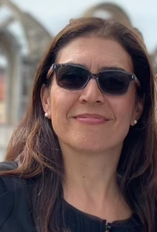

## About Us

    

         
        
    

    

         
        
Hi! I'm Poupak — the founder of Axis Math.

        
I'm a former high school math teacher turned private tutor, with decades of experience in public and private education.

        
In addition to working with students learning the California Math standards, I have also tutored those in other curricula, including the British, Australian, French, and IB systems.

        
As a San Diegan, I founded Axis Math to give back to my community and share my love of teaching math with local students.

        
My teaching philosophy is that everyone can excel at math — not just a talented few. This is possible when students are empowered with a strong foundation and supportive feedback. Therefore, I teach a methodical approach to problem solving, in which students are gradually exposed to complex problems in order to build self-confidence and grow their strengths.

        
I look forward to hearing from you, and I can't wait to help you succeed!

    

